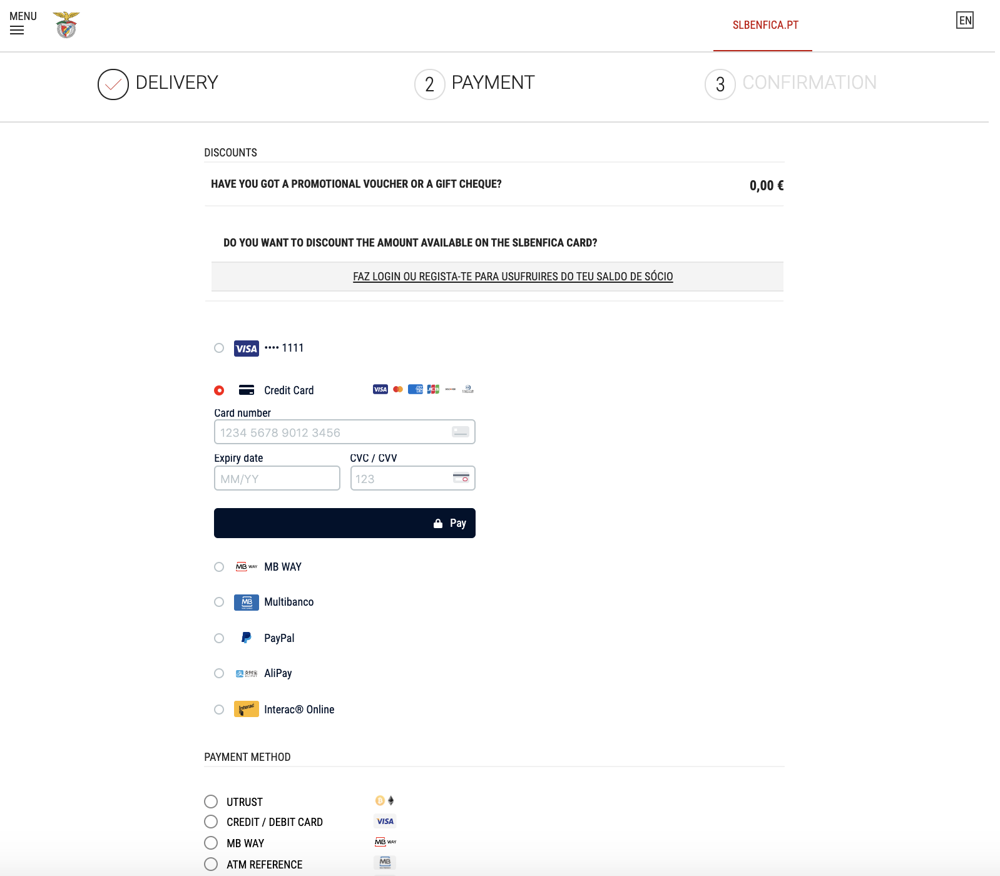

# Adyen Dropin sample code - Mockup on checkout page



> ⚠️ **This repository is for demo purposes only**

## Requirements

To run this project, **create** a `.env` file on your project's root folder following the example on `.env.default`.

```
MERCHANT_ACCOUNT=MyMerchantAccount
CHECKOUT_APIKEY=MY_CHECKOUT_API_KEY
```

These variables can be found in Adyen Customer Area. For more information, visit our [Get started with Adyen guide](https://docs.adyen.com/payments-essentials/get-started-with-adyen).

## Installation

### Running the PHP Server

Navigate to the root of the project and run the `start.sh` script:

```
$ cd benfica-dropin-mockup
$ ./start.sh
```

A PHP server will start on `http://localhost:3000`.

### Running the Node.js Server

If preferred, you can run a Node.js server instead.
To do this, navigate to the root of the project, install the dependencies (only the first time) and run the start script:

```
$ cd benfica-dropin-mockup
$ npm i
$ npm start
```

A Node.js server will start on `http://localhost:3000`.


### Code added for dropin integration

The code for dropin integration has been added at the end of the `index.html` file:

```
<!-- Adyen -->
<link rel="stylesheet" href="https://checkoutshopper-test.adyen.com/checkoutshopper/sdk/3.7.0/adyen.css">
<link rel="stylesheet" href="./style.css">
<script src="https://checkoutshopper-test.adyen.com/checkoutshopper/sdk/3.7.0/adyen.js"></script>
<script src="./utils.js"></script>
<script src="./dropin.js"></script>
```

The code inserted in your custom style.css file after the adyen css file, will override the adyen dropin style.
You can customize it as needed.
